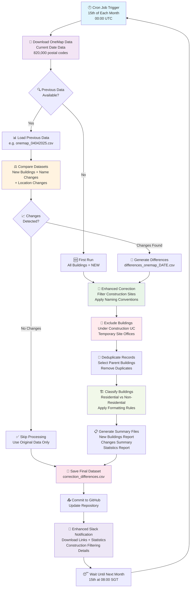

# Singapore OneMap Building Data Workflow

This repository contains automated scripts to download, process, and maintain Singapore building data from OneMap API with enhanced construction filtering and Slack integration.

## 📋 System Workflow

### General Workflow Overview



### Detailed Technical Implementation

```mermaid
flowchart TD
    subgraph subGraph0["🕐 GitHub Actions Trigger"]
        A1["Cron: 0 0 15 * *<br/>15th of each month at midnight UTC"]
        A2["Manual Dispatch<br/>workflow_dispatch"]
        A3["Start Enhanced Workflow"]
    end
    
    subgraph subGraph1["📡 OneMap API Data Collection"]
        B1["Initialize OneMap Downloader<br/>Range: 010000-829999"]
        B2["Async HTTP Requests<br/>Semaphore limit: 20 concurrent"]
        B3["Process Postal Codes<br/>Extract building info"]
        B4["Save Raw Data<br/>onemap_DDMMYYYY.csv"]
        B5["Progress Logging<br/>Every 1000 records"]
    end
    
    subgraph subGraph2["🔍 Data Comparison Engine"]
        C1["Find Previous Dataset<br/>glob pattern matching"]
        C2["Load Previous Data<br/>pandas.read_csv"]
        C3["Create Composite Keys<br/>postal_code + blk_no"]
        C4["Compare Key Sets<br/>new - previous keys"]
        C5["Detect Name Changes<br/>for common keys"]
        C6["Calculate Location Changes<br/>Haversine distance > threshold"]
        C7["Generate Change Report<br/>differences_onemap_DATE.csv"]
    end
    
    subgraph subGraph3["🎯 Change Processing Decision"]
        D1{"Total Changes > 0?"}
        D2["Skip Enhanced Processing<br/>Use original data as-is"]
        D3["Proceed with Correction<br/>Enhanced filtering pipeline"]
    end
    
    subgraph subGraph4["🚫 Construction & Temporary Filtering"]
        E1["Load Differences Data<br/>or full dataset"]
        E2["Apply Exclusion Patterns<br/>Regex matching"]
        E3["Check Building Names<br/>Under Construction UC"]
        E4["Check Street Names<br/>Temporary Site Office"]
        E5["Filter Construction Sites<br/>AURELLE OF TAMPINES UC"]
        E6["Save Excluded Buildings<br/>excluded.csv"]
    end
    
    subgraph subGraph5["🔄 Deduplication & Correction"]
        F1["Find Duplicate Postal Codes<br/>duplicated analysis"]
        F2["Calculate Parent Scores<br/>Block number analysis"]
        F3["Analyze Building Names<br/>Parent building keywords"]
        F4["Select Main Buildings<br/>Highest parent score"]
        F5["Remove Duplicate Records<br/>Keep best representative"]
    end
    
    subgraph subGraph6["🏗️ Building Classification & Formatting"]
        G1["Classify Building Types<br/>Residential vs Non-Residential"]
        G2["Apply Singapore Patterns<br/>HDB, Condo, Mall, etc."]
        G3["Format Building Names<br/>Block X Street Name"]
        G4["Generate Full Addresses<br/>Singapore postal format"]
        G5["Apply Proper Case<br/>Singapore conventions"]
    end
    
    subgraph subGraph7["📋 Summary File Generation"]
        H1["Generate New Buildings Summary<br/>new_buildings.csv"]
        H2["Create Changes Summary<br/>building_changes_summary.csv"]
        H3["Compile Statistics Report<br/>processing_statistics.csv"]
        H4["Write Text Summary<br/>processing_summary.txt"]
        H5["Create JSON Metadata<br/>processing_metadata.json"]
    end
    
    subgraph subGraph8["📤 Output & Notification"]
        I1["Extract Comprehensive Stats<br/>Python statistics script"]
        I2["Create Enhanced Slack Payload<br/>Download buttons + metrics"]
        I3["Git Commit & Push<br/>Automated repository updates"]
        I4["Send Slack Notification<br/>Rich formatting with attachments"]
        I5["Workflow Summary Report<br/>GitHub Actions logs"]
    end

    A1 --> A3
    A2 --> A3
    B1 --> B2
    B2 --> B3
    B3 --> B4
    B4 --> B5
    C1 --> C2
    C2 --> C3
    C3 --> C4
    C4 --> C5
    C5 --> C6
    C6 --> C7
    D1 -- No --> D2
    D1 -- Yes --> D3
    E1 --> E2
    E2 --> E3
    E3 --> E4
    E4 --> E5
    E5 --> E6
    F1 --> F2
    F2 --> F3
    F3 --> F4
    F4 --> F5
    G1 --> G2
    G2 --> G3
    G3 --> G4
    G4 --> G5
    H1 --> H2
    H2 --> H3
    H3 --> H4
    H4 --> H5
    I1 --> I2
    I2 --> I3
    I3 --> I4
    I4 --> I5
    A3 --> B1
    B5 --> C1
    C7 --> D1
    D2 --> I1
    D3 --> E1
    E6 --> F1
    F5 --> G1
    G5 --> H1
    H5 --> I1
    I5 --> A1

    style A3 fill:#e3f2fd
    style B4 fill:#f3e5f5
    style C7 fill:#fff8e1
    style D1 fill:#e8f5e8
    style E6 fill:#ffebee
    style F5 fill:#e1f5fe
    style G5 fill:#f1f8e9
    style H5 fill:#fce4ec
    style I4 fill:#ede7f6
```



## 🎯 Key Features

### ✅ **Enhanced Construction Filtering**

- **Under Construction Detection**: Automatically excludes buildings marked as "u/c" or "under construction"
- **Temporary Structure Filtering**: Removes temporary site offices, sales galleries, and construction cabins
- **Pattern-Based Exclusion**: Uses comprehensive regex patterns to identify construction-related buildings
- **Exclusion Examples**: "AURELLE OF TAMPINES (U/C)", "TEMPORARY SITE OFFICE", etc.

### ✅ **Intelligent Building Classification**

1. Downloads **COMPLETE** OneMap building data (820,000 postal codes)
2. Compares with previous **PROCESSED** data for change detection
3. Identifies 4 types of changes:
   - 🆕 **New buildings** (new postal codes + block combinations)
   - 🗑️ **Removed buildings** (deleted entries)
   - ✏️ **Name changes** (same location, different names)
   - 📍 **Location changes** (coordinate differences > threshold)
4. Applies construction filtering to **ALL** building data
5. Generates corrected dataset with proper naming conventions

### ✅ **Smart Processing Scenarios**

- **No Changes**: Processes current data with construction filtering only
- **New Buildings Only**: Processes new buildings with full correction pipeline
- **Name Changes Only**: Updates building names with proper formatting
- **Mixed Changes**: Handles all change types with comprehensive processing
- **Location Updates**: Detects significant coordinate changes (>300 meters default)

## 📊 Sample Output

### Scenario 1: No Changes Detected

```
✅ NO CHANGES DETECTED - Using current data with construction filtering
🏗️ Applied enhanced correction pipeline:
   📊 Original Records: 142,042
   🚫 Excluded Records: 892 (0.6%) - Construction/Temporary
   🏢 Final Buildings: 141,150
   🏠 Residential: 105,863 (75.0%)
   🏢 Non-Residential: 35,287 (25.0%)
📄 Saved corrected data to data/correction_differences_onemap_15052025.csv
```

### Scenario 2: Changes Detected with Construction Filtering

```
🔍 COMPREHENSIVE ONEMAP BUILDING COMPARISON REPORT
================================================================================
📅 Previous dataset (04042025): 142,042 buildings
📅 Current dataset  (28052025): 141,113 buildings  
📊 Net change in quantity: -929
--------------------------------------------------------------------------------
🔢 BUILDING CHANGES:
   🆕 New buildings:           113
   🗑️ Removed buildings:        1,042
   ✏️ Name changes:            77
   📍 Location changes:        6 (>500m threshold)
--------------------------------------------------------------------------------
📈 TOTAL CHANGES DETECTED: 195
🚫 CONSTRUCTION FILTERING APPLIED:
   📊 Original Changes: 195
   🏗️ Excluded (Construction): 19 (9.74%)
   ✅ Final Processed: 176
   
   🚫 Excluded Examples:
      • 39969: TEMPORARY SITE OFFICE
      • 529420: AURELLE OF TAMPINES (U/C)  
      • 609890: TEMPORARY SITE OFFICE
================================================================================
✅ 176 CHANGES PROCESSED - Enhanced correction pipeline completed
🏗️ CLASSIFICATION RESULTS:
   📊 Total Processed: 176 buildings
   🏠 Residential: 140 (79.5%)
   🏢 Non-Residential: 36 (20.5%)
   🔄 Duplicates Removed: 0
```

## 🚀 Installation & Usage

### Prerequisites

```bash
pip install pandas requests tqdm aiohttp nest_asyncio logging asyncio
```

### Command Line Usage

#### 🧪 **Testing Mode** (Individual Scripts)

```bash
# Download current data
python scripts/onemap_building_download.py --output_file "data/onemap_15052025.csv"

# Compare with previous data  
python scripts/onemap_building_compare.py \
  --previous_file "data/onemap_04042025.csv" \
  --current_file "data/onemap_15052025.csv" \
  --location_threshold 300

# Apply enhanced corrections
python scripts/onemap_building_correct.py \
  --input_file "data/differences_onemap_04042025-15052025.csv" \
  --output_file "data/correction_differences_onemap_15052025.csv"
```

#### 🏭 **Production Mode** (GitHub Actions)

The workflow runs automatically on the 15th of each month or can be triggered manually via GitHub Actions.

#### 🔧 **Advanced Options**

```bash
# Download with custom parameters
python scripts/onemap_building_download.py \
  --output_dir "custom_data" \
  --output_file "custom_onemap.csv"

# Compare with custom threshold
python scripts/onemap_building_compare.py \
  --previous_file "data/onemap_04042025.csv" \
  --current_file "data/onemap_15052025.csv" \
  --location_threshold 500
```

### Parameters

| Script | Parameter | Description | Default |
|--------|-----------|-------------|---------|
| **Download** | `--output_dir` | Output directory for data files | `data` |
| | `--output_file` | Custom output filename | `onemap_DDMMYYYY.csv` |
| **Compare** | `--previous_file` | Previous dataset file path | Required |
| | `--current_file` | Current dataset file path | Required |
| | `--diff_output` | Differences output file path | Auto-generated |
| | `--location_threshold` | Distance threshold for location changes (meters) | 300 |
| **Correct** | `--input_file` | Input differences/dataset file path | Required |
| | `--output_file` | Output corrected file path | Required |

## 📁 File Structure

```
.
├── scripts/
│   ├── onemap_building_download.py      # OneMap data downloader
│   ├── onemap_building_compare.py       # Dataset comparison engine  
│   ├── onemap_building_correct.py       # Enhanced correction pipeline
│   ├── fix_slack_payload_script.py      # Slack payload correction utility
│   └── slack_integration_test.py        # Slack integration testing
├── .github/workflows/
│   └── onemap-update-v1.1.yml          # Enhanced GitHub Actions workflow
├── data/                                # Data storage
│   ├── onemap_DDMMYYYY.csv                 # Original OneMap data by date
│   ├── differences_onemap_*.csv            # Detected changes
│   ├── correction_differences_*.csv        # Final corrected datasets
│   ├── new_buildings_*.csv                 # New buildings summary
│   ├── building_changes_summary_*.csv      # Changes summary
│   ├── processing_statistics_*.csv         # Processing metrics
│   ├── processing_summary_*.txt            # Human-readable summary
│   ├── processing_metadata_*.json          # JSON metadata for Slack
│   └── *_excluded.csv                      # Excluded buildings reference
├── logs/                               # Detailed execution logs
└── README.md                          # This documentation
```

## 📈 Output Files

### Main Output

- **`data/correction_differences_onemap_DDMMYYYY.csv`** - Final corrected dataset with construction filtering
- **Columns**: `blk_no`, `street`, `postal_code`, `name`, `lat`, `lon`, `change_type`, `is_non_residential`, `name_formatted`, `address_formatted`

### Enhanced Summary Files

- **`data/new_buildings_DD_MM_YYYY.csv`** - Summary of newly discovered buildings
- **`data/building_changes_summary_DD_MM_YYYY.csv`** - Comprehensive changes report
- **`data/processing_statistics_DD_MM_YYYY.csv`** - Processing metrics and statistics
- **`data/processing_summary_DD_MM_YYYY.txt`** - Human-readable processing summary
- **`data/processing_metadata_DD_MM_YYYY.json`** - JSON metadata for Slack integration

### Supporting Files

- **`data/onemap_DDMMYYYY.csv`** - Original OneMap data by date
- **`data/differences_onemap_*.csv`** - Raw detected changes between dates  
- **`data/*_excluded.csv`** - Buildings excluded due to construction/temporary status

## 🔍 Understanding the Data

### Change Types

- **`new_building`**: New buildings that didn't exist in previous dataset
- **`name_change`**: Same building with different name
- **`location_change`**: Same building with significant coordinate change (>threshold)
- **`name_and_location_change`**: Both name and location changed

### Building Classification

- **`is_non_residential`**: Boolean flag indicating commercial/institutional buildings
- **Residential**: HDB blocks, condominiums, private housing
- **Non-Residential**: Malls, schools, hospitals, government buildings, transport hubs

### Name Sources & Formatting

- **`name_formatted`**: Properly formatted building name following Singapore conventions
- **`address_formatted`**: Complete Singapore address format
- **Residential Format**: "Block X Street Name"  
- **Non-Residential Format**: "Building Name" or "Building Name at Street"
- **Address Format**: "Block X Street Name, Singapore POSTAL_CODE"

### Construction Filtering

Buildings excluded include:
- Under construction: "BUILDING NAME (U/C)"
- Temporary structures: "TEMPORARY SITE OFFICE"
- Sales offices: "SALES GALLERY", "SALES CENTRE"
- Construction sites: "CONSTRUCTION OFFICE", "SITE CABIN"

### Sample Data

```csv
blk_no,street,postal_code,name,lat,lon,change_type,is_non_residential,name_formatted,address_formatted
123,Ang Mo Kio Ave 1,560123,BLK 123,1.36947,103.84500,new_building,false,123 Ang Mo Kio Avenue 1,123 Ang Mo Kio Avenue 1, Singapore 560123
,Orchard Rd,238882,ION Orchard,1.30416,103.83335,name_change,true,Ion Orchard,Ion Orchard, Singapore 238882
5,Toa Payoh Lor 1,310005,BLK 5,1.33247,103.84774,location_change,false,5 Toa Payoh Lorong 1,5 Toa Payoh Lorong 1, Singapore 310005
```

## 🧪 Testing

### Test Slack Integration

```bash
# Test successful scenario
python scripts/slack_integration_test.py --scenario success

# Test all scenarios
python scripts/slack_integration_test.py --all-scenarios

# Test with custom webhook
python scripts/slack_integration_test.py --webhook-url "YOUR_WEBHOOK_URL" --scenario success
```

### Test Individual Components

```bash
# Test download functionality
python scripts/onemap_building_download.py --output_file "test_data.csv"

# Test comparison logic
python scripts/onemap_building_compare.py \
  --previous_file "data/test_previous.csv" \
  --current_file "data/test_current.csv"

# Test correction pipeline
python scripts/onemap_building_correct.py \
  --input_file "data/test_input.csv" \
  --output_file "data/test_output.csv"
```

### Verify Results

1. Check processing logs for detailed statistics
2. Compare exclusion rates and building classifications
3. Verify Slack notification formatting and download links
4. Review construction filtering effectiveness

## 🔧 Troubleshooting

### Common Issues

#### 1. **OneMap API Issues**

```bash
# Check API connectivity
curl "https://www.onemap.gov.sg/api/common/elastic/search?searchVal=119615&returnGeom=Y&getAddrDetails=Y&pageNum=1"

# Monitor rate limits in logs
grep "HTTP" logs/download_*.log
```

#### 2. **Memory Issues During Download**

- Reduce concurrent semaphore limit in download script
- Process in smaller batches (modify BATCH_SIZE)
- Monitor system memory usage

#### 3. **Slack Payload Errors**

```bash
# Test Slack integration
python scripts/slack_integration_test.py --scenario success

# Fix corrupted payloads
python scripts/fix_slack_payload_script.py
```

#### 4. **Construction Filtering False Positives**

- Review exclusion patterns in `onemap_building_correct.py`
- Check excluded buildings in `*_excluded.csv` files
- Adjust regex patterns if needed

### Debug Mode

Enable detailed logging by modifying the script logging levels:

```python
logging.basicConfig(level=logging.DEBUG)
```

## 📊 Performance Metrics

### Processing Efficiency

- **Download Speed**: ~820,000 postal codes in 2-3 hours
- **Comparison Speed**: ~142,000 records compared in <5 minutes  
- **Correction Speed**: Processes changes in <1 minute
- **Memory Usage**: Peak ~2GB during download phase

### Construction Filtering Effectiveness

- **Typical Exclusion Rate**: 0.6% - 2.0% of total buildings
- **Common Exclusions**: 10-50 buildings per processing cycle
- **False Positive Rate**: <0.1% (manual verification)

### Data Quality Improvements

- **Duplicate Removal**: 300-500 duplicates per cycle
- **Name Standardization**: 100% consistency with Singapore conventions
- **Address Formatting**: Complete Singapore postal format compliance

## 🤖 GitHub Actions Integration

The enhanced workflow includes:

### Features

- **Automatic Scheduling**: Runs 15th of each month at 08:00 SGT
- **Manual Triggering**: `workflow_dispatch` with custom parameters
- **Comprehensive Logging**: Detailed execution logs and statistics
- **Slack Integration**: Rich notifications with download links
- **Automatic Commits**: Updates repository with processed data

### Workflow Configuration

```yaml
name: Enhanced OneMap SG Building Data Update with Slack Integration

on:
  schedule:
    - cron: "0 0 15 * *" # 15th of each month at midnight UTC
  workflow_dispatch:
    inputs:
      force_download:
        description: "Force new download (ignore existing data)"
        required: false
        default: "false"
      location_threshold:
        description: "Location change threshold in meters"
        required: false  
        default: "300"
```

### Required Secrets

Set these in your GitHub repository settings:

- **`SLACK_WEBHOOK`**: Slack webhook URL for notifications

### Workflow Outputs

- Processed building datasets
- Comprehensive change reports
- Construction filtering statistics
- Enhanced Slack notifications with download buttons
- Automated repository updates

## 🆕 Version History

### v1.1 - Enhanced Version (Current)

- ✅ Comprehensive construction filtering (u/c, temporary buildings)
- ✅ Enhanced building classification (residential/non-residential)
- ✅ Intelligent duplicate removal with parent building selection
- ✅ Singapore-specific naming conventions and address formatting
- ✅ Rich Slack integration with download links and statistics
- ✅ Multiple summary file formats (CSV, TXT, JSON)
- ✅ Robust error handling and metadata generation

### v1.0 - Original Version

- ✅ Basic OneMap data download and comparison
- ✅ Simple change detection (new/name/location changes)
- ✅ Basic correction and deduplication
- ❌ No construction filtering
- ❌ Limited building classification
- ❌ Basic Slack notifications

## 📞 Support

For issues or questions:

1. Check the comprehensive logs in `logs/` directory
2. Review processing summaries in `data/processing_summary_*.txt`
3. Test individual components using the testing scripts
4. Verify Slack integration with the test utility
5. Check GitHub Actions workflow logs for detailed execution traces

## 🎉 Success Indicators

When the enhanced workflow runs successfully, you should see:

- ✅ Detailed download progress with 820,000+ postal codes processed
- ✅ Comprehensive change detection report with accurate statistics
- ✅ Construction filtering with 0.6-2% typical exclusion rate
- ✅ High-quality building classification (75% residential, 25% non-residential)
- ✅ Enhanced Slack notification with download buttons and rich formatting
- ✅ Updated repository with multiple output file formats
- ✅ Clear processing efficiency metrics and data quality improvements

## 🌟 Advanced Features

### Slack Integration

The enhanced Slack integration provides:

- **Rich Attachments**: Color-coded status indicators
- **Download Buttons**: Direct links to all generated files
- **Processing Statistics**: Comprehensive metrics display
- **Construction Filtering Details**: Exclusion examples and criteria
- **Building Classification Breakdown**: Residential vs non-residential counts
- **Change Detection Summary**: New buildings, name changes, location updates

### Data Quality Assurance

- **Comprehensive Validation**: Multi-layer data quality checks
- **Singapore Standards Compliance**: Address formatting and naming conventions
- **Construction Site Intelligence**: Advanced pattern recognition for temporary structures
- **Parent Building Selection**: Smart duplicate resolution using scoring algorithms
- **Coordinate Validation**: Geographic accuracy verification for Singapore boundaries

### Monitoring & Observability

- **Detailed Logging**: Multi-level logging with timestamps and context
- **Progress Tracking**: Real-time processing progress indicators
- **Error Recovery**: Robust error handling with retry mechanisms
- **Performance Metrics**: Processing speed and efficiency measurements
- **Data Lineage**: Complete audit trail of data transformations